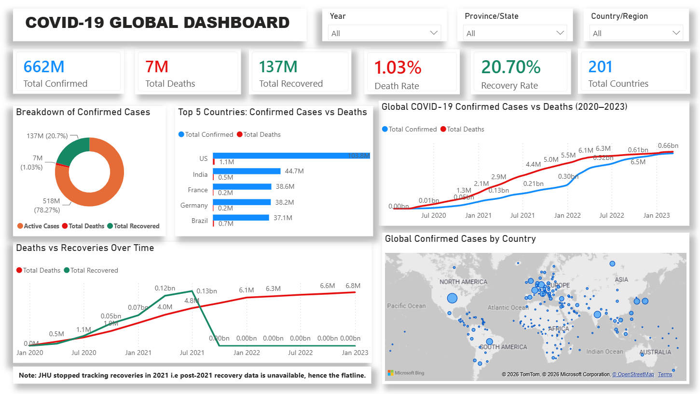

# AnalystLab Africa — Data Analytics Internship (Batch C)

This repository contains all task submissions for the AnalystLab Africa Data Analytics 
Internship Program, Batch C (July–September 2026).

---

## Week 1–2: Data Cleaning & Exploratory Data Analysis

### Overview
Data cleaning and exploratory analysis on two datasets using Python (Pandas, Matplotlib, 
Seaborn) in Google Colab.

### Files
- `online_retail_analysis.ipynb` — Full notebook: cleaning, EDA, visualizations, insights (E-commerce)
- `netflix_analysis.ipynb` — Full notebook: cleaning, EDA, visualizations, insights (Netflix)
- `cleaned_online_retail.zip` — Cleaned E-commerce dataset (CSV, zipped due to GitHub's 25MB limit)
- `cleaned_netflix.csv` — Cleaned Netflix dataset
- `One_Page_Summary_Report.docx` — One-page summary covering cleaning challenges, key EDA findings, and top insights for both datasets

### Tools
Python (Pandas, Matplotlib, Seaborn) via Google Colab

### Notes
- The cleaned e-commerce CSV is zipped due to GitHub's 25MB upload limit — unzip to access.
- Both datasets went through the same process: dataset understanding, missing value handling, 
  duplicate removal, standardization, validation, EDA, visualization, and insight generation.

---

## Week 3: SQL & Data Querying

### Overview
SQL querying and analysis on two databases — the Chinook music store database and a 
Sales dataset — using SQL Server Management Studio (SSMS) with T-SQL syntax.

### Files
- `chinook_queries.sql` — 10 queries on the Chinook database covering core and advanced SQL
- `sales_queries.sql` — 5 queries on the Sales dataset covering business problem solving
- `SQL_Query_Documentation.docx` — Full documentation explaining each query, the SQL concepts 
  used, and the key insight from the results

### SQL Concepts Covered
- SELECT, WHERE, ORDER BY, GROUP BY, HAVING
- Aggregate functions: SUM, COUNT, AVG, ROUND
- Joins: INNER JOIN, LEFT JOIN (multiple tables)
- Subqueries using NOT IN
- Window functions: RANK(), ROW_NUMBER(), running SUM() with OVER() and PARTITION BY
- CTEs (Common Table Expressions) using WITH

### Key Findings
- Nearly half the Chinook catalog (1,519 of 3,503 tracks) has never been purchased
- Rock dominates the Chinook catalog with 1,297 tracks — more than double any other genre
- Euro Shopping Channel (Spain) accounts for $912K in sales — the single largest customer
- Classic Cars is the top product line at $3.9M; November consistently spikes due to Q4 demand

### Tools
SQL Server Management Studio (SSMS), T-SQL

---

## Week 4: COVID-19 Global Dashboard | Power BI

### Project Overview
This project was completed as part of the AnalystLab Africa Data Analytics Internship (Week 4).
The objective was to analyze the Johns Hopkins University CSSE Global COVID-19 Dataset and build 
an interactive dashboard that communicates key insights through effective data visualization and storytelling.

### Problem Statement
Public health organizations require reliable visual analytics to monitor COVID-19 trends, compare 
countries, and identify patterns that support informed decision-making.

This dashboard answered questions such as:
- Which countries recorded the highest confirmed cases?
- How did confirmed cases and deaths change over time?
- What was the global death rate?
- How were confirmed cases distributed geographically?

### Dataset
| | |
|---|---|
| **Source** | Johns Hopkins University CSSE COVID-19 Repository |
| **Period Covered** | January 2020 – March 2023 |

### Tools Used
- Power BI
- Power Query
- DAX

### Data Preparation
The original dataset was stored in a wide format with more than 1,100 date columns.
The following transformations were performed in Power Query:
- Promoted the first row to headers
- Unpivoted date columns
- Removed unnecessary columns
- Merged datasets
- Created relationships
- Built DAX measures for KPIs

### Dashboard Preview

### Dashboard Features
- Interactive slicers
- KPI Cards
- Geographic Map
- Trend Analysis
- Country Comparison
- Recovery vs Death Analysis

### Key Insights
- United States recorded the highest confirmed COVID-19 cases
- The dataset represents 201 countries
- Global death rate remained approximately 1.03%
- Recovery tracking stopped in mid-2021, limiting long-term recovery analysis

### Challenges
- Wide-format dataset requiring extensive transformation
- Cumulative data required careful DAX calculations
- Missing recovery data after mid-2021
- Power Query transformation workflow

### Files Included
- Power BI Dashboard (.pbix)
- Dashboard Screenshots
- Presentation Slides

---
## About
**Intern:** Adeniji Shukrat Opeyemi
**Program:** AnalystLab Africa Data Analytics Internship — Batch C
**Duration:** 1st July to 1st September 2026
**LinkedIn:** www.linkedin.com/in/shukrohadeniji
